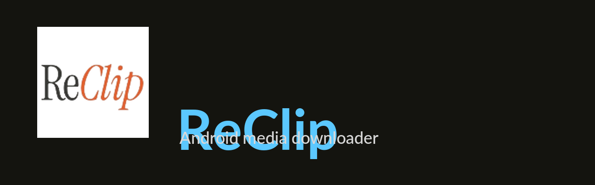

  

  <a href="README.md">🇬🇧 English</a> &nbsp;·&nbsp; <b>🇮🇹 Italiano</b>

# ReClip for Android

Scarica video e audio da oltre 1000 siti (YouTube, TikTok, Instagram,
Twitter/X, Reddit, Facebook, Vimeo, Twitch…) direttamente sul telefono.

> ## ⚠️ Opera derivata
>
> Questo progetto è un **derivato** di **[ReClip](https://github.com/averygan/reclip)**
> di [**averygan**](https://github.com/averygan), distribuito con licenza **MIT**
> (Copyright (c) 2026).
>
> Il merito dell'idea e dell'applicazione originale è **interamente dell'autore
> originale**. Qui è stato aggiunto solo il *packaging Android*.
> Il file `reclip/LICENSE` (MIT) è mantenuto intatto.

---

## Cosa fa

- **Interfaccia web dentro l'app** — niente browser, niente server da configurare
- **Barra di avanzamento reale**: percentuale, MB, velocità ed ETA
- **Salva direttamente in `Download/`**
- **Video a piena qualità** (1080p/4K) e audio **MP3**
- **Due versioni**: 🇬🇧 inglese e 🇮🇹 italiana

## Le due versioni

| Versione | Nome app | Interfaccia |
|---|---|---|
| 🇬🇧 English | **ReClip** | Inglese |
| 🇮🇹 Italiano | **ReClip IT** | Italiano |

Hanno package diversi, quindi puoi **installarle entrambe** sullo stesso telefono.

## Compatibilità

| | |
|---|---|
| **Android** | **7.0 o superiore** (API 24+). Su Android 5/6 **non** si installa. |
| **Telefoni a tasti (non Android)** | ❌ non supportati — nessun APK può funzionare |
| **CPU** | **arm64-v8a** (tutti gli smartphone moderni) e **armeabi-v7a** (dispositivi 32-bit) |
| **Emulatori (x86/x86_64)** | non inclusi |
| **WebView** | serve una *Android System WebView* / Chrome aggiornata: su WebView molto vecchie l'interfaccia non si carica |
| **RAM** | consigliati 2 GB o più (Python + WebView): con 512 MB–1 GB funziona, ma è lento |
| **Spazio** | l'APK è ~82 MB, più lo spazio per i file che scarichi |

## Installazione

1. Scarica l'APK che ti interessa dalla pagina [**Releases**](../../releases)
   (`reclip-it-release-signed.apk` o `reclip-en-release-signed.apk`).
2. Aprilo. Android avviserà che l'installazione da questa origine non è permessa.
3. Consenti l'installazione e procedi:
   - **Android stock / Motorola:** *Impostazioni → App → Accesso speciale →
     Installa app sconosciute* → scegli l'app da cui stai installando (browser,
     File, app di messaggistica) → **Consenti**
   - **Samsung:** *Impostazioni → App → ⋮ (in alto a destra) → Accesso speciale →
     Installa app sconosciute* → scegli l'app → **Consenti**
4. Se Play Protect mostra un avviso, scegli **Installa comunque** (l'app non
   viene dal Play Store).
5. Apri **ReClip**. Il server parte da solo — ti basta toccare
   **Apri interfaccia web**.

> Hai già una vecchia versione **debug** installata? Disinstallala prima: è
> firmata con una chiave diversa e non può essere aggiornata. Una volta passato
> a una versione release, gli aggiornamenti si sovrascrivono senza disinstallare.

## Compilare dal sorgente

Vedi [**BUILD.md**](BUILD.md).

## Limitazioni note

- **Uso personale**: il download da piattaforme terze può violare i loro termini
  di servizio. Valuta tu cosa scaricare.
- Il salvataggio passa dall'app (una WebView Android non può scaricare da sola).
- I log diagnostici restano nella memoria privata dell'app e si esportano solo
  su richiesta col pulsante **Esporta log di debug**.

## Licenza e crediti

- **ReClip originale**: © 2026 [averygan](https://github.com/averygan) — [MIT](https://github.com/averygan/reclip/blob/main/LICENSE)
- **Questo derivato**: stessa licenza **MIT**; il testo originale è preservato in
  `reclip/LICENSE`.
